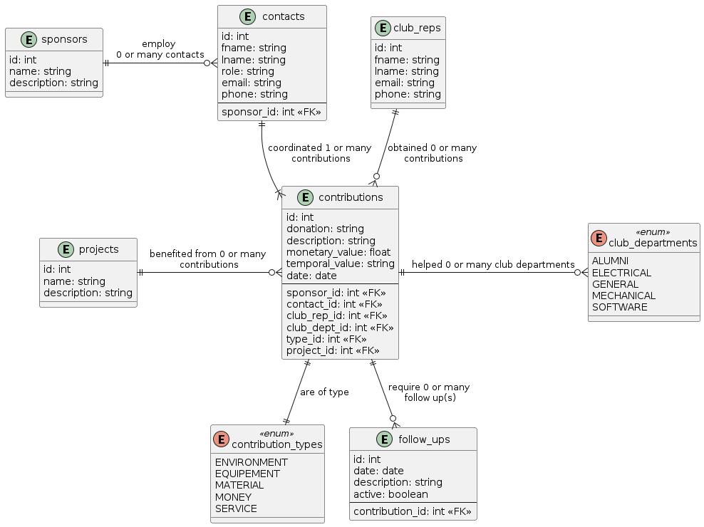
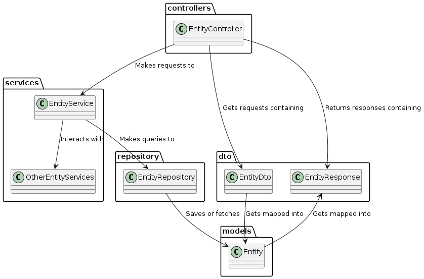

# Lean Six Management Project for an IT System
This project, as part of a deliverable for the masters course MTI825 at École de Technologie Supérieure, consists of applying Lean Six Management to identify and eliminate waste.

## Table of Contents
- [Overview](#overview)
  - [Backend tools](#backend-tools)
  - [Tools](#tools)
- [Using the app](#using-the-app)
  - [Prequisites](#prerequisites)
  - [Developer mode](#developer-mode)
    - [Additional prerequisites](#additional-prerequisites)
    - [Setup instructions](#setup-instructions-1)
    - [Useful commands](#useful-commands)
  - [Stable mode](#stable-mode)
    - [Setup instructions](#setup-instructions-2)
    - [Teardown instructions](#teardown-instructions)
- [Contextual information for the project](#context)
  - [The assignment](#assignment)
  - [The client : SONIA](#client)
  - [The challenge](#challenge)
  - [The solution](#solution)
- [Solution architecture](#solution-architecture)
  - [Entity relationship diagram](#entity-relationship-diagram)
  - [High level class/package diagram](#high-level-classpackage-diagram)
  - [Generalized sequence diagram](#generalized-sequence-diagram)


## Overview
### Backend tools
- **Java 17** - Runtime environment for the application;
- **Spring Boot** - Main framework used for building the API and managing application configuration;
- **Lombok** - Reduces boilerplate code by auto-generating getters, setters and constructors;
- **JPA (Jakarta)** - ORM specification used to map Java classes to database tables;
- **PostgreSQL** - Relational database used to store application data.


**Note** : there is currently no frontend. API interaction is handled via Postman using the request file in /docs.


### Tools
- Docker - Containerization platform used to package the app and its dependencies;
- Docker Compose - Used to orchestrate and run the app and database together;
- Postman - API client used to send HTTP requests for testing and interacting with the backend.


## Using the app
### Prerequisites
Before running the app in any mode, ensure the following tools are installed:
- **Docker Desktop**, which includes Docker Engine and Docker Compose:
  - [Mac installation guide](https://docs.docker.com/desktop/setup/install/mac-install/);
  - [Windows installation guide](https://docs.docker.com/desktop/setup/install/windows-install/);
- [**Postman**](https://www.postman.com/downloads/) - for testing API requests;


### Developer mode
This mode is ideal for rapid development and testing. It runs the backend using `mvn spring-boot:run` and connects to a manually created PostgreSQL container.
Use this when:
- You're actively modifying backend logic;
- You want faster startup without full Docker builds.


#### Additional prerequisites
- [**Apache Maven**](https://maven.apache.org/download.cgi) - for running the app
  - Using the terminal to run `sudo apt install maven` can also be used;
  - Verify the installation by running `mvn -v`;


#### Setup instructions
1. **Clone the project** to your machine;
2. **Open the project** with your preferred IDE (I used Visual Studio Code);
3. Open a terminal within your IDE (Ctrl+` for Visual studio code);
    - Ensure that the terminal points at the root of the project;
5. Run `cd sponsors/sonia`;
4. Create a PostgreSQL container:
```
docker run --name <postgres_container_name> \
  -e POSTGRES_DB=<your_database_name> \
  -e POSTGRES_USER=<your_username> \
  -e POSTGRES_PASSWORD=<your_password> \
  -p 5432:5432 \
  -d postgres
```
  - Optional checks: 
    - Open Docker Desktop and verify that a container with the name your specified is running;
    - run `docker ps` and verify that a PostgreSQL container is up on port 5432;
5. Run `mvn spring-boot:run`;
    - Wait for the project to build, look for *`Tomcat started on port 8080 (http) with context path '/'`*;
    - Optional: verify that [localhost](http://localhost:8080) displays the message *`Welcome to Sonia!`*;


#### Useful commands
Connecting to the PostgreSQL database
1. Open a new terminal;
2. Run `psql -h localhost -U <your_username> -d <your_database_name>`;
3. When prompted, enter `<your_password>`;
4. Run various queries as needed;
    - For example, display the database tables with `\dt;`

Reloading the project in case the build system and the IDE (Visual Studio Code) get out of sync
1. `Ctrl+Shift+p` and run `Developer:Reload Window`
2. mvn clean install
3. mvn spring-boot:run

Stopping the PostgreSQL container, which is useful for liberating port 5432 when running in `stable mode`
1. Stop the container with `docker container stop <postgres_container_name>`;
2. Verify that the container is no longer running with `docker ps`.


### Stable mode
This mode mimics a more stable and reproducible environment using `docker-compose`.
Use this when:
- You're preparing for a demo or deployment;
- You want to run the entire stack with one command.


#### Setup instructions
1. **Clone the project** to your machine;
2. **Open the project** with your preferred IDE (I used Visual Studio Code);
3. **Create a `.env`** file at the root of the project and define the following variables:
  ```env
  POSTGRES_DB=your_database_name
  POSTGRES_USER=your_username
  POSTGRES_PASSWORD=your_password
  SPRING_DATASOURCE_URL=jdbc:postgresql://<host>:<port>/<db_name>
  ```
  - `host` should match the service name in docker-compose.yml (postgres);
  - `port` is usually 5432;
  - `db_name` should match the value assigned to POSTGRES_DB.
4. Open a terminal within your IDE (Ctrl+` for Visual studio code);
    - Ensure that the terminal points at the root of the project;
5. Run `docker compose up --build`;
    - Wait for the project to build, look for *`Tomcat started on port 8080 (http) with context path '/'`*;
    - Optional:
      - Open Docker Desktop and verify that the Compose stack `sonia_club` has containers `postgres_sponsors` and `sponsors_app`;
      - Verify that [localhost](http://localhost:8080) displays the message *`Welcome to Sonia!`*;
      - Run `docker ps` to confirm containers are active on ports 8080 and 5432 (or another port you specified the `.env` file);
6. Open Postman and import [the Postman requests collection](docs/Sonia.postman_collection.json) into Postman;
7. Use the requests by following the order of the numbered collections.
    - Start by creating sponsors and interact with them;
    - Proceed with creating other entities by following the numbered collections.


#### Teardown instructions
1. Use `Ctrl+c` to stop the containers;
    - Optional: stop the containers using the Docker Desktop interface;
2. Run `docker compose down` to delete the containers;
    - Optional: delete the containers using the Docker Desktop interface.


# Contextual information for the project
## The client : SONIA
SONIA is a scientific student club à École de Technologie Supérieure (ÉTS) that specializes constructing autonomous submarines. [Visit their website](https://sonia.etsmtl.ca/) for more information on their ongoing projects and their team.


## The context
To fund their project activities, the scientific club depends on investments. A part of it originates from ÉTS, but a bigger percentage of it comes from external organisations, referred to as sponsors. A sponsor's contribution can be of various types outside of monetary, such as the following:
- Material, like parts or equipements;
- Environment, like lending a swimming pool for tests;
- Service, like verifying a circuit board.

Considering the various types of contributions, SONIA usually quantifies their value in terms of monetary value or time saved in terms of progressing a project. The issue is the informal process within the scientific club for persisting the data using various inadapted tools: various Excel files, emails or simply a club reps remembering in their own head.


## The challenge
Due to the simple nature of the information, it is easy to default to using simple and accessible tools such as the three mentioned previously. However, that informal process becomes problematic as the amount of informations increases and the tools cannot scale with the club's needs. As a result, it becomes difficult to find past contributions to quantify their value.

Moreover, some sponsors demand some follow ups or feedback regarding a contribution that they have made, yet it often happens that their contact information is very difficult to find or even lost as it cannot be found within the many tools. With delayed or incomplete follow ups, partnership renewals may not be renewed.

All in all, _Extra Processing_ was identified as the main waste at the heart of the issue. Having to move back and forth between Excel files, emails and club reps to find contribution or contact information adds unnecessary steps for what should ideally be an easy information query. The additional processes also lead to other wastes like _Waiting_, _Inventory_ and _Motion_.


## The solution
To help mitigate the _Extra Processing_ waste, a prototype was devised to tackle the issue at its base. The idea is to standardize the process for recording a contribution and contact information for a sponsor, all while facilitating the information research. Making a tool that becomes the single source of information for SONIA would allow the club reps to prevent having to go through extra steps of checking through many tools and people, with the potential outcome of not finding the desired information.

And so, the following solution was created : a simple Spring Boot API that allows its users to record information in a PostgreSQL database. Considering that this is a prototype, there is no frontend app, nor any rigorous testing nor complete functionalities. The basics for recording information was prioritized, with the idea that the scientific club would take the effort in tailoring the solution as they need to.

## Solution architecture
### Entity relationship diagram

As indicated by the diagram, **contributions are at the heart of the system**, representing donations made by sponsor through tehir contacts. The structure makes it easier to track each contribution back to its source - both the sponsor organization and the individual contact involved.

Contributions also help progress the scientific club's projects and are obtained by club reps, allowing them to be searched through them.

Additionally, the system simplified the process of tracking follow-ups after a contribution is made ensuring that the club can uphold its commiments and maintain their relationships with the sponsors.


### High level class/package diagram

This diagram illustrates how the backend classes of the project interact across layers. While the application includes many classes and packages, this simplified view focuses on the general data flow for a typical entity.

At the top of the architecture is the **controller**, which acts as the entry point for handling HTTP requests. It coordinates with the **service** layer, which contains the core business logic and orchestrates operations involving the database.

The **service** delegates data access tasks to the **repository**, which interacts with the database using JPA to query or persist data. The **repository** fetches or saves instances of the **entity**, which represents the structure of the data stored in the PostgreSQL database.

To support clean separation between internal models and client-facing data, the system uses *DTOs* (Data Transfer Objects). The **EntityDto** defines the expected format of incoming requests, while the **EntityResponse** specifies how responses are structured when returned to the client.

### Generalized sequence diagram
